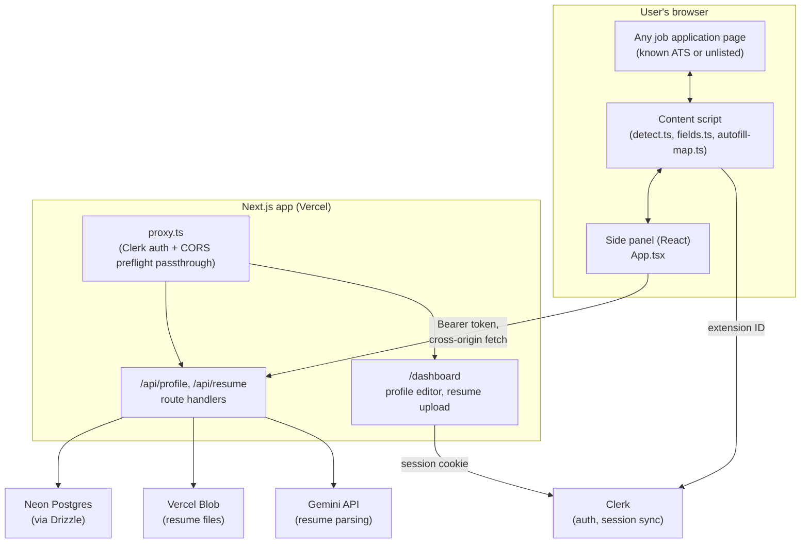

# Job Jet — Architecture

**What it is:** a Chrome extension that recognizes job application forms on
(in principle) any site and helps fill them — autofill from a profile you
set up once, or a resume generated to match the specific job description —
backed by a Next.js web app for account management, profile storage, and AI
work.

**What it deliberately isn't:** a job board or aggregator. Job Jet doesn't
crawl or index job listings; it works on whatever application page you're
already looking at. See [Scope boundaries](#scope-boundaries-and-why) for
why that's a design choice, not a gap.

---

## System overview



## Monorepo layout

```
apps/
  web/         Next.js 16 (App Router) — auth, dashboard, all backend API routes
  extension/   Chrome MV3 extension — Vite + @crxjs/vite-plugin + React
packages/
  shared/      zod schemas shared by both: Profile, Resume, Application, FieldMapping
```

npm workspaces, no separate package manager. `packages/shared` is the single
source of truth for data shapes both apps agree on.

---

## Detection: how it recognizes "this is a job application"

`apps/extension/src/lib/detect.ts`, run by the content script on
`document_idle` and re-run on SPA route changes (a `MutationObserver`
watching for `location.href` changes, since job boards are almost all
client-side routed).

Two paths, OR'd together:

1. **Known-ATS fast path** — a hostname allowlist (Greenhouse, Lever,
   Workday, Ashby, iCIMS, SmartRecruiters, LinkedIn, etc.). Near-instant,
   near-zero false positives.
2. **Generic scored heuristic**, for everything else — a company's own
   careers page, an ATS not on the list. Scores on: URL/title keywords,
   page-text keywords ("cover letter," "work authorization," "equal
   opportunity employer"), form-field name/label keywords, presence of a
   file input, and input count. A page must clear a confidence threshold
   **and** show actual form-field evidence — text keywords alone are
   insufficient. That second condition was added after dogfooding: Job
   Jet's own landing page (which talks about resumes and job descriptions
   in its marketing copy) was tripping the detector despite having zero
   real form fields.

On a positive detection, a floating button is injected into a **shadow
DOM** (`floating-button.ts`) so the host page's CSS can never clash with
or override it. Clicking it opens `chrome.sidePanel`.

## Autofill: three tiers, all built

```
1. Heuristic (built)       — client-side keyword matching, no network cost
                              beyond fetching the profile itself.
2. Known-site adapter (built for Greenhouse, Lever, Ashby) — targets each
                              platform's documented, stable field ids/names
                              directly instead of guessing from label text.
3. LLM fallback (built)    — whatever tiers 1–2 miss, sent to the backend,
                              matched against a closed set of known profile
                              attributes, cached per-domain in
                              `field_mappings` so the same field wording on
                              the same ATS only ever costs one real model
                              call across ALL users, not one per user.
```

**Tier 1** (`apps/extension/src/lib/autofill-map.ts`) matches each detected
field's name/id/label against the user's profile by regex keyword —
first/last name, email, phone, LinkedIn/portfolio links (matched from the
profile's `links[]` by label/URL), location, work authorization,
sponsorship, most recent job's company/title, most recent school/degree.

**Tier 2** (`apps/extension/src/lib/adapters/`) — built after inspecting
real, live job postings (not from memory): a Greenhouse posting at
`job-boards.greenhouse.io/figma/jobs/...`, a Lever posting at
`jobs.lever.co/palantir/.../apply`, and an Ashby posting at
`jobs.ashbyhq.com/fieldguide/.../application`. These platforms use
plain-English labels for their standard fields, so tier 1 already covers
a fair amount — tier 2's actual value is precision: it targets each
platform's stable element `id` (Greenhouse: `first_name`, `last_name`,
`email`, `phone`, `candidate-location`; Ashby: a `_systemfield_*` id
prefix — `_systemfield_name`, `_systemfield_email`, `_systemfield_resume`)
or `name` attribute (Lever: `name`, `email`, `phone`, `location`, `org`,
`urls[LinkedIn]`, `urls[GitHub]`, `urls[Portfolio]`) directly, guaranteed
identical across every company hosted on that platform, rather than
fuzzy-matching label text. `runAutofillMapping()` composes the two tiers:
the adapter claims what it recognizes, the heuristic only runs on the
fields left over (a field is never filled twice via two different
selectors aimed at the same element).

Ashby's adapter is narrower in practice than the other two: its only
truly id-stable fields are name/email/resume, and name/email are also
already reachable by tier 1's type/label matching post the "Legal Name"
fix below — so the adapter's edge there is precision over an already-
working heuristic path, not reaching something otherwise unreachable.

Deliberately **not** covered by the adapters: each platform's per-job
custom questions (Greenhouse's `question_<id>`, Lever's
`cards[<uuid>][fieldN]`, Ashby's random-UUID ids) — their ids/names
aren't stable across postings. Their *labels* often are, though
("LinkedIn Profile", "Are you legally authorized to work in the US?")
— that's tier 3's job.

**Workday has no adapter** — its only field verified live tonight
(`data-automation-id="email"`, plus `password`/`verifyPassword`/
`createAccountCheckbox`/a honeypot named `beecatcher`) is on the
account-creation step every "Apply Manually" flow requires first; the
real application fields (name, phone, address, work history) are behind
that signup wall and weren't inspected — creating a throwaway account to
see past it wasn't done unprompted. Building an adapter from Workday's
generally-known `data-automation-id` conventions instead of a live
capture would be a real departure from how every other adapter here was
built, so it was deliberately skipped rather than guessed at.

**A real, previously-unknown limitation found via this same testing
round, unrelated to any of the above**: SmartRecruiters' "Easy Apply"
widget renders its actual fields entirely inside **open shadow DOM**
roots (37 shadow roots on one page) — not an iframe, so it isn't
something `frameId`/`all_frames` scoping touches at all. Plain
`document.querySelector`/`querySelectorAll` don't cross shadow
boundaries, so field detection wasn't reporting "0 matched", it
genuinely couldn't see 14 real, visible fields existed. Fixed with
`apps/extension/src/lib/dom-deep.ts` (`queryDeep`/`queryAllDeep`,
recursing into every open shadow root), wired into `detect.ts`,
`fields.ts`, and `main-world-fill.ts`. Closed shadow roots remain
unreachable by design — no technique gets past genuine encapsulation —
but every real site found so far uses open mode.

Verified against real captured field data from all three adapter-covered
live postings (`apps/extension/scripts/verify-adapters.ts`,
`npm run verify:adapters`): correctly fills 7/11 Greenhouse fields, 8/10
Lever fields, and 5/9 Ashby fields — correctly skipping file inputs, EEO
fields, and genuinely open-ended questions in all three cases.

**Tier 3** (`apps/extension/src/lib/api.ts`'s `mapFieldsWithLLM`,
`apps/web/src/app/api/autofill/map/route.ts`) runs only on whatever tiers
1–2 left unclaimed on a given fill (and never on file inputs — those are
never scriptable regardless of tier). It's "safe by construction" the same
way resume-tailor.ts is: **the model never sees or returns an actual
value**. It's given each unmatched field's label/name/placeholder/type and
a fixed, hand-written list of ~16 known profile attributes (`fullName`,
`email`, `linkedin`, `currentCompany`, `authorizedToWork`, etc. — see
`apps/web/src/lib/field-paths.ts`), and picks a KEY from that list per
field, or `null` if none confidently apply (open-ended questions, salary
expectations, "how did you hear about us" — this tier isn't meant to
invent answers to those). The real value is then resolved from the user's
*actual* profile in code, after the model call returns — a hallucinated or
malformed key just fails to resolve, the field stays unfilled, nothing
fabricated ever reaches the page.

Before any model call, each field is normalized into a `fieldSignature`
(`packages/shared/src/field-mapping.ts`'s `computeFieldSignature` — label
text over id/name, since ids like `question_19432571004` are
per-posting-random but labels usually aren't) and checked against the
crowdsourced `field_mappings` table, keyed by `(domain, fieldSignature)`.
Only genuine cache misses reach the LLM; a mapping decision, once made,
benefits every user who hits that same field wording on that domain again
— the cache stores *which attribute a label means*, never any user's
actual value, so it's safe to share across users. Cache hits also get
their `hitCount` bumped (best-effort, not on the response's critical
path). If the LLM call itself fails (rate limit, model hiccup), tier 3
degrades to a no-op rather than surfacing an error — it's strictly
additive on top of tiers 1–2, never something that can make Autofill
itself fail.

Two things it **deliberately never fills**, by design, not oversight:
- **File inputs** (resume uploads) — browsers restrict scripted
  `input[type=file].files` for security. Autofill reports this in its
  summary rather than silently skipping it.
- **Voluntary EEO self-identification fields** (gender, ethnicity,
  veteran/disability status, pronouns) — even where a pattern match would
  be easy, these stay opt-in and manual. Guessing or auto-filling
  demographic disclosure is the kind of "helpful" that isn't.

Getting the profile into the side panel at all required solving a
cross-origin problem: the extension (`chrome-extension://...`) and the web
app (`https://...`) are different origins with no shared cookie jar. The
side panel gets a Clerk session token via `useAuth().getToken()` and sends
it as `Authorization: Bearer <token>` (`apps/extension/src/lib/api.ts`);
the backend answers with matching CORS headers scoped to the extension IDs
listed in `ALLOWED_EXTENSION_IDS` (any `chrome-extension://` origin in
development if unset; none in production — `apps/web/src/lib/cors.ts`), and `proxy.ts`
lets the unauthenticated `OPTIONS` preflight through so the CORS handshake
itself isn't blocked by Clerk's auth check before the browser ever sends
the real request.

## Auth: one Clerk session, two surfaces

- **Web app**: standard `@clerk/nextjs`, `ClerkProvider` in `layout.tsx`
  (inside `<body>` — a Clerk Core 3 requirement), `proxy.ts` protecting
  `/dashboard` and `/api/*` via `clerkMiddleware`. Every protected route
  also does its own resource-level `auth()` check (not just relying on the
  middleware matcher) — Clerk's own deprecation notice on
  `createRouteMatcher` warns that path-matching in middleware can diverge
  from actual routing.
- **Extension**: `@clerk/chrome-extension`'s `ClerkProvider`, configured
  with `syncHost` pointed at the web app and
  `__experimental_syncHostListener` enabled — without that flag, a session
  started on the web app only reflects in the side panel after it's closed
  and reopened (a documented SDK limitation); the listener makes it live.
- **Data model**: Clerk is the identity source of truth; a `users` row is
  lazily upserted (`get-or-create-user.ts`) the first time an authenticated
  request touches the database, rather than syncing via webhooks.

## Data model (Neon Postgres, via Drizzle)

`apps/web/src/db/schema.ts`:

| Table | Purpose |
|---|---|
| `users` | Mirrors the Clerk user — stable FK target for everything else. |
| `profiles` | One per user: the structured data autofill reads from and the profile dashboard editor writes to. |
| `resumes` | Every uploaded original and AI-tailored version — structured content, Blob URL, `kind` (`uploaded_original` / `ai_tailored`). |
| `applications` | Job tracker — schema exists (`status`: detected → draft → applied → interviewing → rejected/offer), **not yet wired to any UI**. |
| `field_mappings` | Crowdsourced, cross-user: once one person's form gets mapped for a domain, everyone hitting that domain benefits without re-asking the LLM. Backs tier-3 autofill (`/api/autofill/map`). |

## AI: Gemini, and why this specific model

`apps/web/src/lib/ai.ts` is the single seam for which LLM backs the app —
swapping providers later (Vercel AI Gateway, a different model) is a
one-file change. Currently Gemini via a free API key, using
**`gemini-2.5-flash`** specifically, chosen the hard way:

- `gemini-flash-latest` (an alias) returned `503 UNAVAILABLE` — overloaded.
- `gemini-3.6-flash` (the model Google's own API error recommended as the
  replacement) worked, but took ~29 seconds to parse one resume and, once,
  leaked stray internal self-check narration straight into a structured
  output field (`summary` came back containing "Cheating check. Accent
  check... Perfect! Accuracy check." — text that doesn't exist anywhere in
  the source resume). It also silently returned empty `experience` and
  `education` arrays despite the source resume clearly having both.
- `gemini-2.5-flash` parses the same resume in ~1 second with clean output.
  Verified against a real generated PDF: name, email, phone, location,
  both links, both jobs with every bullet, the one school, and the summary
  all came back correct.

`apps/web/src/lib/resume-parse.ts` calls this via the AI SDK's
`generateObject`, against a zod schema kept intentionally separate from
`packages/shared`'s (documented inline). Originally apps/web resolved zod
v4 while the shared package was on v3, and mixing the two majors broke
TypeScript's structural inference against `generateObject`'s types. All
workspaces are now on zod 4; the local AI schemas stay separate because
they intentionally differ (no `id` fields, model-specific shape).

Getting a PDF into text for that call hit its own bundling bug:
`pdf-parse` (via `pdfjs-dist`) dynamically resolves its own worker script
by file path at runtime, which breaks under Next.js's server bundling
("Setting up fake worker failed"). Fixed via `serverExternalPackages` in
`next.config.ts` — the same mechanism Next's own docs list `sharp` and
`canvas` under for the same class of problem.

### Profile completeness

Parsing (or manual entry) doesn't guarantee the profile actually has what
autofill and tailoring need — a resume with no LinkedIn link, or a user
who's never answered the work-authorization checkboxes, just leaves those
fields blank with nothing flagging it. `ProfileEditor.tsx` computes a live
checklist (`computeCompleteness`) against exactly the fields the rest of
the product reads — name/email (required, also enforced server-side by the
schema), phone, location, a link, work authorization, and at least one
experience/education/skill entry (each recommended, not required) — and
renders it as a progress card at the top of the editor, or a green
"complete" line once nothing's missing. Recalculates on every keystroke,
not just right after a resume import.

## Testing without hitting real ATS sites

`apps/extension/test-fixtures/` — a zero-dependency Node static server
(`npm run test:fixtures`, port 4000) serving:

- A single-step job application form exercising nearly every field-keyword
  signal the heuristic looks for.
- A 5-step wizard where fields only exist in the DOM for the currently
  active step (not just CSS-hidden) and the URL hash changes per step —
  the harder, more realistic case that mirrors how real SPA-driven ATS
  wizards behave.
- A plain content page as a negative control.

All three verified against the built extension in a real browser.

## Design system

A token-based system rather than one-off Tailwind classes, defined once in
`apps/web/src/app/globals.css` (`--background`, `--surface`, `--border`,
`--muted`, `--accent`, plus shadow tokens) and mirrored with matching hex
values in the extension's `sidepanel/styles.css`, so the web app and the
extension read as one product rather than two. **Light theme only, by
deliberate choice** — `color-scheme: light` (not `light dark`) and no
`prefers-color-scheme` media query, so the app renders light regardless of
the visitor's OS setting; this also makes Clerk's own components
(`<SignIn>`, `<UserButton>`, etc., which auto-adapt to the `color-scheme`
property) stay light without any extra config. An earlier version of this
system supported both themes — dropped in favor of light-only per explicit
direction, along with the color palette itself (warm cream background,
vivid green accent) taken from a reference image, restyling the brand mark
to match (`logo-mark.svg`, the extension's baked icon PNGs, and the
floating button's gradient all regenerated/recolored together so nothing
was left mismatched).

The dashboard is a proper app shell (`DashboardShell.tsx`): a sidebar with
the current "Profile" section active and "Applications" / "Tailored
resumes" shown as disabled nav items labeled "Soon" — an honest way to
show product direction without a nav link to a page that doesn't exist yet.

**Second design pass** (structural, not just color): the marketing pages'
header is now an inset floating pill nav rather than a full-width bar, and
the hero/final-CTA sections carry a soft blurred violet glow behind them
for depth — both verified in a real browser in *both* themes (light
verified via a temporary injected CSS override forcing the light token
values, since this session's OS default is dark; nothing about that
override is in the shipped code). Also fixed along the way, found by
actually looking rather than assumed: Chrome's native autofill styling
was overriding our input colors with its own grey/yellow highlight
(`:-webkit-autofill` needs its own override, globals.css); Job Jet's own
web app is now explicitly excluded from the extension's detection (its
host is derived from the build's `VITE_CLERK_SYNC_HOST` — `localhost:3001`
in dev, the deployed domain in production; see `own-app.ts`) — the profile/resume dashboard has enough genuine
form-field evidence (real inputs, a real file upload) to pass the
heuristic even after the earlier text-keyword fix, so the floating button
was showing up on our own product.

## Scope boundaries, and why

A few things intentionally aren't built, each for a concrete reason rather
than "haven't gotten to it":

- **No job aggregation/matching feed.** Building one means crawling or
  partnering with enough sources to sustain a large, current listing
  index — real infrastructure and licensing exposure, and it's not what
  autofill+tailoring actually requires. Job Jet works on whatever page
  you're already on.
- **No referral/insider-networking feature.** Needs real people-data at
  company-and-alumni granularity — a licensed dataset or partnership, not
  something to fabricate.
- **No AI chat "copilot" persona.** Would be straightforward to bolt on
  given the Gemini integration already in place, but hasn't been asked
  for as a standalone feature yet.
- **Branding/visual design is original to Job Jet**, not derived from any
  other product's actual logo, copy, or layout — copying a real company's
  trademark and product design isn't something built here regardless of
  how comparable the underlying feature set is.

## Resume tailoring pipeline

Triggered from the extension side panel's "Generate tailored resume for
this job" button (the JD is already in hand there — auto-extracted from
the page). `POST /api/resume/tailor` (`src/app/api/resume/tailor/route.ts`):

1. Reads the user's saved **profile** (not a re-parsed upload) — the
   profile is the canonical, user-reviewed source, so tailoring always
   starts from the most correct data available.
2. `src/lib/resume-tailor.ts` calls Gemini, but is deliberately **safe by
   construction**, not just prompted to be careful: the model is only ever
   asked to (a) rewrite the summary, (b) reword each role's *existing*
   bullets — same role, same bullet count in and out, so it can't add a
   bullet's worth of fabricated achievement — and (c) reorder/select from
   the user's *existing* skill names. It never sees a path to touch name,
   contact info, links, employers, titles, dates, or education; those are
   copied through from the source profile in code. The model's skill list
   is validated against the real list afterward too — anything it invents
   is dropped, anything it silently omits is appended back so nothing is
   ever lost, only reordered. This matters more here than in resume
   parsing: parsing is extractive (the model can only get facts wrong),
   tailoring is generative (a fabricated bullet reads perfectly plausibly
   on a resume a human then submits under their own name).
3. `src/lib/resume-pdf.tsx` renders the result via `@react-pdf/renderer` —
   single-column, no tables/graphics (multi-column resumes are a known way
   to break ATS text extraction), built-in Helvetica so nothing needs
   embedding.
4. Stored in the private Blob store, a new `resumes` row (`kind:
   "ai_tailored"`) with `tailoredFor: { jobTitle, company, jobDescription }`.

**Downloading** needed its own route because the Blob store is private
(`access: "private"`, set when it was provisioned) — a `blobUrl` alone
isn't fetchable by a browser. `GET /api/resume/[id]/download` checks
ownership, then streams the file server-side via `@vercel/blob`'s `get()`
with `Content-Disposition: attachment`. The web dashboard uses a plain
`<a href>` (cookie auth carries through on same-origin navigation); the
extension can't do that (a `chrome.tabs.create` navigation wouldn't carry
the Bearer token cross-origin), so it fetches the bytes with the same
Bearer-token pattern as everything else, then opens them via
`URL.createObjectURL` in a new tab.

Verified end-to-end with a real Gemini call and a real generated PDF: the
summary and skill order came back correctly tailored to a sample JD, the
downloaded file passed a magic-byte check (`%PDF-`) with the right
content-type and a plausible size, and the dashboard's resume list update
was confirmed live in the browser.

## Auto-continue: multi-step forms without re-clicking Autofill

The first manual "Autofill" click arms auto-continue for the rest of that
page: the side panel polls (every 1.5s, `AUTO_CONTINUE_POLL_MS` in
`App.tsx`) for fields that weren't there last time it looked — a wizard
step advancing — and fills just those, no repeat click needed.

**Why polling, not a `MutationObserver` message from the content script**:
detecting "new fields appeared" is something the content script could do
on its own, but *acting* on them (fetch the profile, map it) needs the
Clerk session, which only exists in the side panel's React context — the
content script is an isolated world with no access to it. So the content
script stays dumb (it just answers `REQUEST_FORM_FIELDS` on request, same
as the manual path) and the side panel does the noticing.

**Safety net**: if the active tab navigates to a genuinely different site
(hostname change), auto-continue disarms itself rather than keep trying to
fill a page the user has moved on from. Deliberately *not* triggered by
every URL change — `history.pushState` on the *same* hostname (which is
exactly how this project's own multi-step test fixture, and plenty of real
ATS wizards, advance between steps) must not be treated as "navigated
away", or the feature would disarm itself on the very transition it exists
to survive.

**Real limitation, stated plainly**: this only works while the side panel
stays open — there's no background-authenticated path yet, so closing the
panel mid-wizard stops auto-continue (a manual click after reopening it
picks back up from wherever the wizard is).

## Application tracker

`applications` (schema, unchanged from initial design) now has a full
CRUD surface: `GET`/`POST /api/applications`, `PATCH`/`DELETE
/api/applications/[id]`, all CORS-enabled the same way as every other
extension-facing endpoint. A `notes` column and a unique `(userId, url)`
index were added on top of the original schema.

**Entries are created automatically, not manually** — the extension
upserts one (fire-and-forget, `src/lib/api.ts`'s `upsertApplication`,
swallows its own errors so a tracking failure never blocks the actual
autofill/tailoring feature) whenever the user clicks **Autofill** or
**Generate tailored resume** on a detected job page. That's a deliberate
threshold: creating an entry on every page *visit* (tied to detection
alone) would flood the tracker with postings glanced at and never acted
on; tying it to actual engagement keeps it meaningful. The upsert is keyed
on `(userId, url)`, so repeat engagement with the same posting updates the
existing row (status, linked resume) instead of duplicating it —
verified: POSTing the same URL twice with a different status returned the
same row id and left the total count unchanged.

**Real bug found by testing against the actual multi-step wizard, not
just the single-step case**: the wizard fixture changes the URL hash per
step (`#personal`, `#resume`, `#experience`...) via `history.pushState`.
Autofilling across all 5 steps of a real run created 5 separate tracker
entries for one application, because the upsert key was the *full* URL
including that hash. Fixed by stripping the hash before dedup/storage in
the `POST` handler — re-verified afterward by POSTing the same job under
all 5 of that run's actual hash values: all 5 collapsed to one row, one
id, stored URL with the hash gone. Query params are deliberately left
alone (some ATS URLs encode the real job id there, unlike the hash in this
case) — noted as a related, unfixed risk (a referral/UTM param on an
otherwise-identical URL would still create a duplicate) rather than
guessed at with a blind strip.

The dashboard's `/dashboard/applications` page (`ApplicationsBoard.tsx`)
groups entries by status (detected/draft → applied → interviewing → offer
→ rejected, empty groups hidden) with an inline status dropdown, a resume
picker linking any of the user's saved resumes, and a notes field that
saves on blur. Deleting asks for confirmation via the browser's native
`confirm()` — ordinary and appropriate for a real delete button in a web
app (unrelated to the "don't trigger dialogs" rule that governs this
project's own browser-automation *testing*, which is about not getting
automation tooling stuck, not about how the shipped product should behave).

Verified end-to-end in a real browser: created via `POST`, confirmed the
upsert-by-url behavior doesn't duplicate, watched the status dropdown and
notes textarea both persist through the real `PATCH` route (not just
optimistic local state), confirmed `DELETE` removes it and the empty state
returns cleanly, and confirmed the list is correctly scoped per-user (a
second test account saw an empty tracker while the first account's data
existed).

## Known gaps / next up

- Known-site adapters (tier 2) built for Greenhouse, Lever, and Ashby;
  Workday, iCIMS, SmartRecruiters are on the known-ATS hostname list for
  detection but don't have adapters yet — tier 3 (LLM fallback, now built)
  is what covers them in the meantime, at the cost of a model call on
  first sight of each field wording per domain instead of an instant,
  free, exact match. Workday specifically needs a real signed-in test
  account before an adapter can be built the same verified-live way the
  others were — see the tier-2 section above.
- Skill-matching for per-job yes/no technology questions ("Do you have
  experience with Docker/Kubernetes?") — found live on a real Workday
  posting, not built. Distinct from tier 3's allow-list (which answers
  fixed facts about the candidate): this would check whether keywords
  extracted from the question text appear in the user's actual saved
  skills list — safe (a factual check, no fabrication risk) but a
  genuinely new capability, not a tweak to the existing allow-list.
- Tier 3's allow-list (`field-paths.ts`) covers ~16 scalar profile
  attributes — the same ones tiers 1/2 already target. It doesn't reach
  into `additionalQuestions` (free-form Q&A the profile schema already has
  room for but no UI writes to yet) or attempt genuinely open-ended
  questions (cover letters, "why us", salary expectations) — those stay
  unanswerable by design, not oversight; inventing an answer to a real
  application question is a different, much riskier feature than matching
  a label to an already-known fact.
- File-input autofill (attaching a resume automatically via the
  `DataTransfer` workaround) — not implemented; the side panel tells the
  user explicitly that file fields need manual attachment.
- Auto-continue has no background-auth path — see above; needs the panel
  open.
