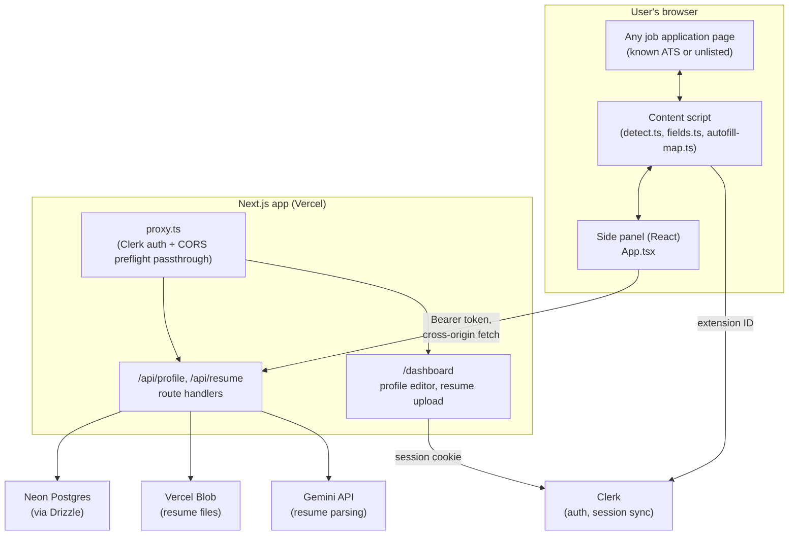

# Job Jet — Architecture

**What it is:** a Chrome extension that recognizes job application forms on
(in principle) any site and helps fill them — autofill from a profile you
set up once, or a resume generated to match the specific job description —
backed by a Next.js web app for account management, profile storage, and AI
work.

**What it deliberately isn't:** a job board or aggregator. Job Jet doesn't
crawl or index job listings; it works on whatever application page you're
already looking at. See [Scope boundaries](#scope-boundaries-and-why) for
why that's a design choice, not a gap.

---

## System overview



## Monorepo layout

```
apps/
  web/         Next.js 16 (App Router) — auth, dashboard, all backend API routes
  extension/   Chrome MV3 extension — Vite + @crxjs/vite-plugin + React
packages/
  shared/      zod schemas shared by both: Profile, Resume, Application, FieldMapping
```

npm workspaces, no separate package manager. `packages/shared` is the single
source of truth for data shapes both apps agree on.

---

## Detection: how it recognizes "this is a job application"

`apps/extension/src/lib/detect.ts`, run by the content script on
`document_idle` and re-run on SPA route changes (a `MutationObserver`
watching for `location.href` changes, since job boards are almost all
client-side routed).

Two paths, OR'd together:

1. **Known-ATS fast path** — a hostname allowlist (Greenhouse, Lever,
   Workday, Ashby, iCIMS, SmartRecruiters, LinkedIn, etc.). Near-instant,
   near-zero false positives.
2. **Generic scored heuristic**, for everything else — a company's own
   careers page, an ATS not on the list. Scores on: URL/title keywords,
   page-text keywords ("cover letter," "work authorization," "equal
   opportunity employer"), form-field name/label keywords, presence of a
   file input, and input count. A page must clear a confidence threshold
   **and** show actual form-field evidence — text keywords alone are
   insufficient. That second condition was added after dogfooding: Job
   Jet's own landing page (which talks about resumes and job descriptions
   in its marketing copy) was tripping the detector despite having zero
   real form fields.

On a positive detection, a floating button is injected into a **shadow
DOM** (`floating-button.ts`) so the host page's CSS can never clash with
or override it. Clicking it opens `chrome.sidePanel`.

## Autofill: three planned tiers, two built

```
1. Heuristic (built)        — client-side keyword matching, no network cost
                               beyond fetching the profile itself.
2. Known-site adapter (built for Greenhouse + Lever) — targets each
                               platform's documented, stable field ids/names
                               directly instead of guessing from label text.
3. LLM fallback (not built) — whatever tiers 1–2 miss, sent to the backend,
                               mapped against the profile schema, cached
                               per-domain in `field_mappings` so repeat
                               visits to the same ATS don't re-hit the LLM.
```

**Tier 1** (`apps/extension/src/lib/autofill-map.ts`) matches each detected
field's name/id/label against the user's profile by regex keyword —
first/last name, email, phone, LinkedIn/portfolio links (matched from the
profile's `links[]` by label/URL), location, work authorization,
sponsorship, most recent job's company/title, most recent school/degree.

**Tier 2** (`apps/extension/src/lib/adapters/`) — built after inspecting
two real, live job postings (not from memory): a Greenhouse posting at
`job-boards.greenhouse.io/figma/jobs/...` and a Lever posting at
`jobs.lever.co/palantir/.../apply`. Both platforms use plain-English labels
for their standard fields, so tier 1 already covers a fair amount — tier
2's actual value is precision: it targets each platform's stable element
`id` (Greenhouse: `first_name`, `last_name`, `email`, `phone`,
`candidate-location`) or `name` attribute (Lever: `name`, `email`, `phone`,
`location`, `org`, `urls[LinkedIn]`, `urls[GitHub]`, `urls[Portfolio]`)
directly, guaranteed identical across every company hosted on that
platform, rather than fuzzy-matching label text. `runAutofillMapping()`
composes the two tiers: the adapter claims what it recognizes, the
heuristic only runs on the fields left over (a field is never filled twice
via two different selectors aimed at the same element).

Deliberately **not** covered by the adapters: each platform's per-job
custom questions (Greenhouse's `question_<id>`, Lever's
`cards[<uuid>][fieldN]`) — their ids/names aren't stable across postings,
and the questions themselves are often genuinely open-ended ("what's the
hardest technical challenge you've faced"), unanswerable from a static
profile field. That's what tier 3 (LLM fallback, using the profile + job
description as context) is for.

Verified against real captured field data from both live postings
(`apps/extension/scripts/verify-adapters.ts`, `npm run verify:adapters`):
correctly fills 7/11 Greenhouse fields and 8/10 Lever fields, correctly
skipping file inputs, EEO fields, and genuinely open-ended questions in
both cases.

Two things it **deliberately never fills**, by design, not oversight:
- **File inputs** (resume uploads) — browsers restrict scripted
  `input[type=file].files` for security. Autofill reports this in its
  summary rather than silently skipping it.
- **Voluntary EEO self-identification fields** (gender, ethnicity,
  veteran/disability status, pronouns) — even where a pattern match would
  be easy, these stay opt-in and manual. Guessing or auto-filling
  demographic disclosure is the kind of "helpful" that isn't.

Getting the profile into the side panel at all required solving a
cross-origin problem: the extension (`chrome-extension://...`) and the web
app (`https://...`) are different origins with no shared cookie jar. The
side panel gets a Clerk session token via `useAuth().getToken()` and sends
it as `Authorization: Bearer <token>` (`apps/extension/src/lib/api.ts`);
the backend answers with matching CORS headers scoped specifically to
`chrome-extension://` origins (`apps/web/src/lib/cors.ts`), and `proxy.ts`
lets the unauthenticated `OPTIONS` preflight through so the CORS handshake
itself isn't blocked by Clerk's auth check before the browser ever sends
the real request.

## Auth: one Clerk session, two surfaces

- **Web app**: standard `@clerk/nextjs`, `ClerkProvider` in `layout.tsx`
  (inside `<body>` — a Clerk Core 3 requirement), `proxy.ts` protecting
  `/dashboard` and `/api/*` via `clerkMiddleware`. Every protected route
  also does its own resource-level `auth()` check (not just relying on the
  middleware matcher) — Clerk's own deprecation notice on
  `createRouteMatcher` warns that path-matching in middleware can diverge
  from actual routing.
- **Extension**: `@clerk/chrome-extension`'s `ClerkProvider`, configured
  with `syncHost` pointed at the web app and
  `__experimental_syncHostListener` enabled — without that flag, a session
  started on the web app only reflects in the side panel after it's closed
  and reopened (a documented SDK limitation); the listener makes it live.
- **Data model**: Clerk is the identity source of truth; a `users` row is
  lazily upserted (`get-or-create-user.ts`) the first time an authenticated
  request touches the database, rather than syncing via webhooks.

## Data model (Neon Postgres, via Drizzle)

`apps/web/src/db/schema.ts`:

| Table | Purpose |
|---|---|
| `users` | Mirrors the Clerk user — stable FK target for everything else. |
| `profiles` | One per user: the structured data autofill reads from and the profile dashboard editor writes to. |
| `resumes` | Every uploaded original and AI-tailored version — structured content, Blob URL, `kind` (`uploaded_original` / `ai_tailored`). |
| `applications` | Job tracker — schema exists (`status`: detected → draft → applied → interviewing → rejected/offer), **not yet wired to any UI**. |
| `field_mappings` | Crowdsourced, cross-user: once one person's form gets mapped for a domain, everyone hitting that domain benefits without re-asking the LLM. For the not-yet-built tier-3 autofill. |

## AI: Gemini, and why this specific model

`apps/web/src/lib/ai.ts` is the single seam for which LLM backs the app —
swapping providers later (Vercel AI Gateway, a different model) is a
one-file change. Currently Gemini via a free API key, using
**`gemini-2.5-flash`** specifically, chosen the hard way:

- `gemini-flash-latest` (an alias) returned `503 UNAVAILABLE` — overloaded.
- `gemini-3.6-flash` (the model Google's own API error recommended as the
  replacement) worked, but took ~29 seconds to parse one resume and, once,
  leaked stray internal self-check narration straight into a structured
  output field (`summary` came back containing "Cheating check. Accent
  check... Perfect! Accuracy check." — text that doesn't exist anywhere in
  the source resume). It also silently returned empty `experience` and
  `education` arrays despite the source resume clearly having both.
- `gemini-2.5-flash` parses the same resume in ~1 second with clean output.
  Verified against a real generated PDF: name, email, phone, location,
  both links, both jobs with every bullet, the one school, and the summary
  all came back correct.

`apps/web/src/lib/resume-parse.ts` calls this via the AI SDK's
`generateObject`, against a zod schema kept intentionally separate from
`packages/shared`'s (documented inline) — apps/web resolves zod v4 while
the shared package's schemas are built against v3, and mixing the two
majors broke TypeScript's structural inference against `generateObject`'s
types.

Getting a PDF into text for that call hit its own bundling bug:
`pdf-parse` (via `pdfjs-dist`) dynamically resolves its own worker script
by file path at runtime, which breaks under Next.js's server bundling
("Setting up fake worker failed"). Fixed via `serverExternalPackages` in
`next.config.ts` — the same mechanism Next's own docs list `sharp` and
`canvas` under for the same class of problem.

## Testing without hitting real ATS sites

`apps/extension/test-fixtures/` — a zero-dependency Node static server
(`npm run test:fixtures`, port 4000) serving:

- A single-step job application form exercising nearly every field-keyword
  signal the heuristic looks for.
- A 5-step wizard where fields only exist in the DOM for the currently
  active step (not just CSS-hidden) and the URL hash changes per step —
  the harder, more realistic case that mirrors how real SPA-driven ATS
  wizards behave.
- A plain content page as a negative control.

All three verified against the built extension in a real browser.

## Scope boundaries, and why

A few things intentionally aren't built, each for a concrete reason rather
than "haven't gotten to it":

- **No job aggregation/matching feed.** Building one means crawling or
  partnering with enough sources to sustain a large, current listing
  index — real infrastructure and licensing exposure, and it's not what
  autofill+tailoring actually requires. Job Jet works on whatever page
  you're already on.
- **No referral/insider-networking feature.** Needs real people-data at
  company-and-alumni granularity — a licensed dataset or partnership, not
  something to fabricate.
- **No AI chat "copilot" persona.** Would be straightforward to bolt on
  given the Gemini integration already in place, but hasn't been asked
  for as a standalone feature yet.
- **Branding/visual design is original to Job Jet**, not derived from any
  other product's actual logo, copy, or layout — copying a real company's
  trademark and product design isn't something built here regardless of
  how comparable the underlying feature set is.

## Known gaps / next up

- Autofill tier 3 (LLM fallback + `field_mappings` cache) — not built.
  Known-site adapters (tier 2) built for Greenhouse and Lever; Workday,
  Ashby, iCIMS, SmartRecruiters are on the known-ATS hostname list for
  detection but don't have adapters yet.
- Resume tailoring pipeline (job description → AI-reworded resume → PDF
  via `@react-pdf/renderer` → Blob) — not built; `resumes.kind` already
  has an `ai_tailored` variant reserved for it in the schema.
- Application tracker UI — the `applications` table exists, nothing reads
  or writes it yet.
- The extension's ID isn't yet registered in Clerk's `allowed_origins`,
  so cross-origin session sync is wired but unverified end-to-end.
- File-input autofill (attaching a resume automatically via the
  `DataTransfer` workaround) — not implemented; the side panel tells the
  user explicitly that file fields need manual attachment.
